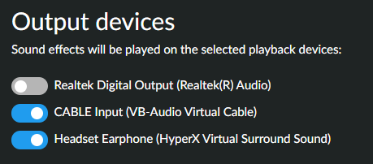
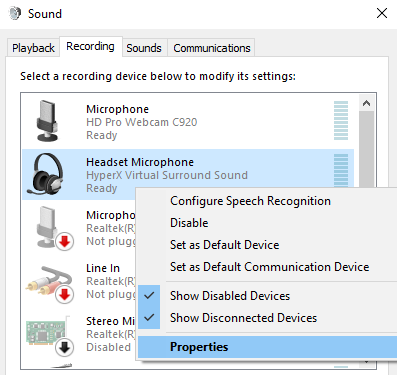
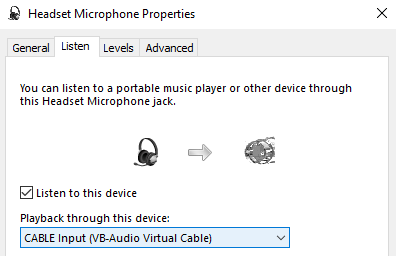
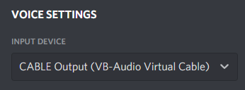

# How to use with Voice Chat applications on Windows

* Install [VB-CABLE Virtual Audio Device](https://vb-audio.com/Cable/).
* After installing the virtual cable, restart the Soundboard.
* Enable the CABLE Input device in the Settings window, along with your output device of choice if you want to hear the sounds as well:
  
* Open the Start Menu, type `mmsys.cpl`, press <kbd>Enter</kbd>.
* Go to the "Recording" tab, right-click on your microphone or headset device, and click on **Properties**:
  
* Go to the "Listen" tab, check the "Listen to this device" box, and choose the "CABLE Input" device in "Playback through this device":
  
* Press "Apply" and "OK" on both dialogs.
* In your voice chat application, select "CABLE Output" as your input device:
  
