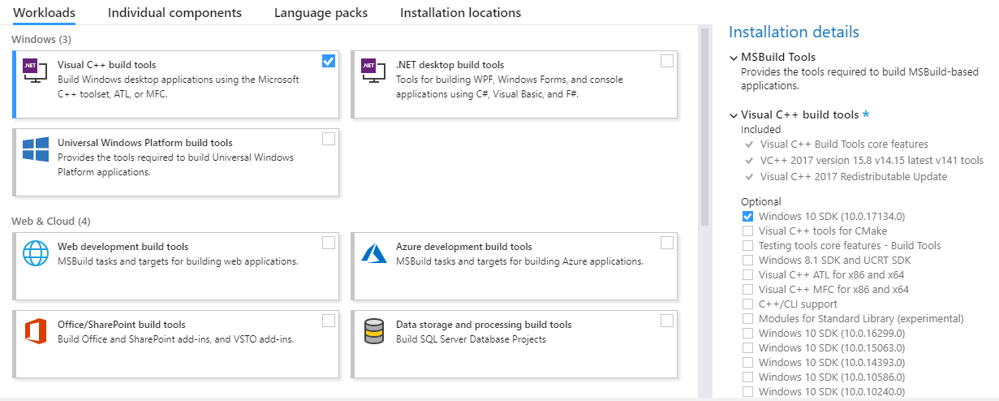

## Windows prerequisites

### Rust

On Windows, the Rust compiler needs the Visual C++ Build tools:

Download the [Microsoft Visual C++ Build Tools](https://visualstudio.microsoft.com/thank-you-downloading-visual-studio/?sku=BuildTools).

When installing, choose "Visual C++ build tools" in the "Workloads" tab.
Also tick the optional feature "Windows SDK":

Install [Rust](https://www.rust-lang.org/en-US/install.html).
